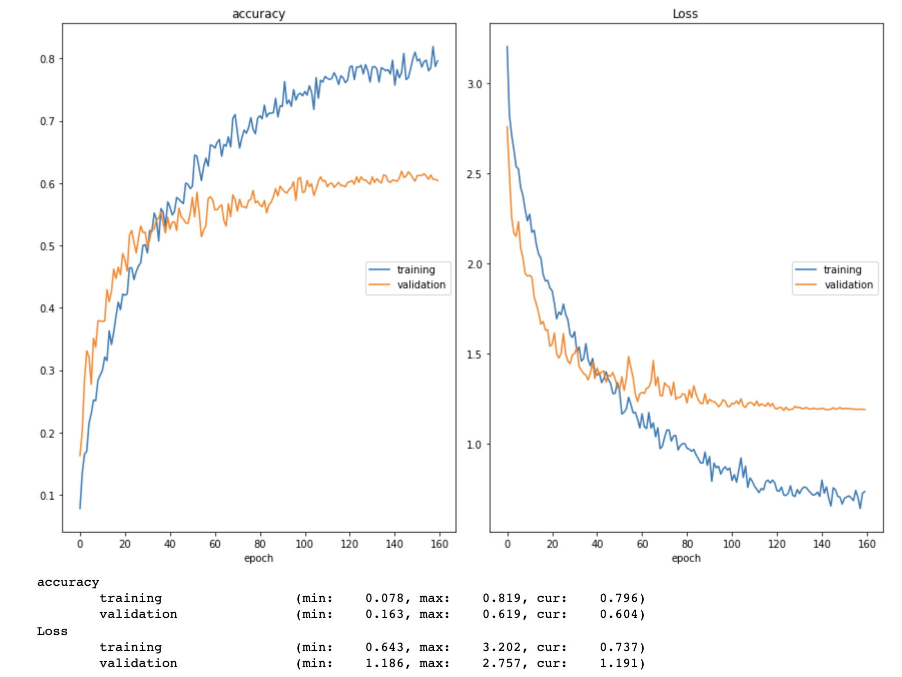

## Model design

The general idea of CNN for image classification is to gradually subsample (downsize) the image while increasing the number of channels to obtain a smaller feature map. One assumption behind CNNs is that a local understanding of an image is good enough. Therefore, before feeding the feature map to the fully connected layer(s) in the end, each pixel from the feature map contains information from a small patch of the original image.

To reduce the number of model parameters:
* Smaller input resolution. With the same model structure, the parameters grow proportionally as the input image size increases. I used 128x128 in my model, but a similar model that takes 48x48 input can achieve 50%+ val acc.
* Gradually increase channels. I modified 3-128-128 to 3-16-16-32-32-48. The model becomes deeper, and with maxpooling after each conv block, the number of parameters is greatly reduced.
* Less fully connected (linear/dense) layers. Multiplying big matrices is expensive. I use only one (432x20) and in the experiment, I found it unnecessary to add more.

To enhance model performance:
* Conv-BN-ReLU is a common way to build a block. `BatchNorm` re-scales the input for the following layer and helps stabilize training.
```
class ConvBN(nn.Module):
    def __init__(self, nc):
        super().__init__()
        self.convbnrelu = nn.Sequential(
            nn.Conv2d(nc, nc, kernel_size = 3, stride = 1, padding = 1),
            nn.BatchNorm2d(nc),
            nn.ReLU(),
            nn.Conv2d(nc, nc, kernel_size = 3, stride = 1, padding = 1),
            nn.ReLU(),
        )
    def forward(self, x):
        return self.convbnrelu(x)
```
* Dropout. Add a dropout layer before linear projections to avoid overfitting. e.g.:
```
nn.Flatten(),
nn.Dropout(0.5),
nn.Linear(432,20)
```
* Residual block (skip connection) idea from ResNet. Simply define a new module that adds an identity connection for a given module:
```
class ResBlock(nn.Module):
    def __init__(self, module):
        super().__init__()
        self.module = module

    def forward(self, inputs):
        return self.module(inputs) + inputs
```


Eventually, the model is defined as follows (#params=51812):

```
class SceneClassifier(torch.nn.Module):
    def __init__(self):
        super(SceneClassifier, self).__init__()
        self.network = nn.Sequential(
            
            nn.Conv2d(3, 16, kernel_size = 5, padding = 1),
            nn.BatchNorm2d(16),
            nn.ReLU(),
            nn.MaxPool2d(2,2),
            ResBlock(ConvBN(16)),
            nn.MaxPool2d(2,2),
            
            nn.Conv2d(16, 32, kernel_size = 3, stride = 1, padding = 1),
            nn.BatchNorm2d(32),
            nn.ReLU(),
            
            ResBlock(ConvBN(32)),
            nn.MaxPool2d(2,2),
            nn.Conv2d(32 ,48, kernel_size = 3, stride = 1, padding = 1),
            nn.BatchNorm2d(48),
            nn.ReLU(),
            nn.MaxPool2d(4,4),
            
            nn.Flatten(),
            nn.Dropout(0.5),
            nn.Linear(432,20)
        )
        
    def forward(self, x):
        return self.network(x)
```

To further improve it:
* Add more branches in ResBlock. For example, borrow the block design ideas from Inception or ResNext.
* Append more layers.
* Use higher resolution input.
* Use depthwise-separable convolution to make it even more compact.

## Training

Each "trick" only takes 1-2 lines of code and barely slows down training.

* Optimizer. Our task is to train from scratch, in which case Adam (or RAdam/AdamW) usually converges faster than SGD.
* Tune the learning rate and batch size. 
* Learning rate scheduler. A scheduler with a decaying learning rate helps the model converge at a good minima. In PyTorch: ExponentialLR, StepLR, CosineAnnealing etc.
* Normalize the model input for both train and val.
* Data augmentation. Simply adding a random horizontal flip boosts ~3% in val accuracy.

With the same setting, the validation accuracy still "shakes" across different runs. For example, my val accuracy varies from 59.9% to 62.9%.



Training script:
```
batch_size = 32
n_epochs = 120
learningRatse = 1e-3
cost_function = torch.nn.CrossEntropyLoss()
model = SceneClassifier()
torch.manual_seed(2)

optimizer = torch.optim.AdamW(model.parameters(), lr = learningRate)
# scheduler = torch.optim.lr_scheduler.ExponentialLR(optimizer, gamma=0.97)
scheduler = torch.optim.lr_scheduler.CosineAnnealingWarmRestarts(optimizer, T_0=120, T_mult=1, eta_min=5e-6, last_epoch=-1)
img_size = 128

transform = transforms.Compose([transforms.Resize((img_size, img_size)),
                                transforms.ToTensor(),
                                transforms.Normalize((0.5, 0.5, 0.5), (0.5, 0.5, 0.5))])

transform_train = transforms.Compose([transforms.Resize((img_size, img_size)),
                                transforms.RandomHorizontalFlip(),
                                transforms.ToTensor(),
                                transforms.Normalize((0.5, 0.5, 0.5), (0.5, 0.5, 0.5))])

trainset = SUN20(split = 'train', transform = transform_train)
valset = SUN20(split = 'val', transform = transform)

train_loader = torch.utils.data.DataLoader(trainset, 
                                           batch_size = batch_size, 
                                           shuffle = True, 
                                           pin_memory = True,
                                           num_workers = 2)
val_loader = torch.utils.data.DataLoader(valset, 
                                         batch_size = batch_size, 
                                         shuffle = False)

train_model(batch_size, n_epochs, learningRate, 
            model, cost_function, optimizer, scheduler, 
            train_loader, val_loader) 
```


Things I tried but did not help:
* "Square padding": input images in our dataset are rectangles with varying width-height ratios. I tried to pad the shorter edge and make it square before resizing, hoping that would preserve some shape information.
```
class SquarePad:
    def __call__(self, image):
        max_wh = max(image.size)
        p_left, p_top = [(max_wh - s) // 2 for s in image.size]
        p_right, p_bottom = [max_wh - (s+pad) for s, pad in zip(image.size, [p_left, p_top])]
        padding = (p_left, p_top, p_right, p_bottom)
        return transforms.functional.pad(image, padding, 0, 'constant')
```
* Parameter initialization. Different initialization for different parts of the model.

```
import torch.nn.init as init
def init_params(net):
    '''Init layer parameters.'''
    for m in net.modules():
        if isinstance(m, nn.Conv2d):
            init.kaiming_normal_(m.weight, mode='fan_out')
            if m.bias:
                init.constant(m.bias, 0)
        elif isinstance(m, nn.BatchNorm2d):
            init.constant_(m.weight, 1)
            init.constant_(m.bias, 0)
        elif isinstance(m, nn.Linear):
            init.normal_(m.weight, std=1e-3)
            if m.bias:
                init.constant(m.bias, 0)
````

